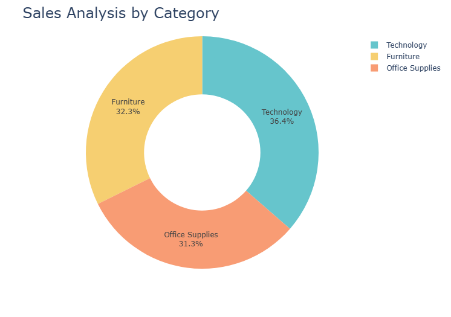
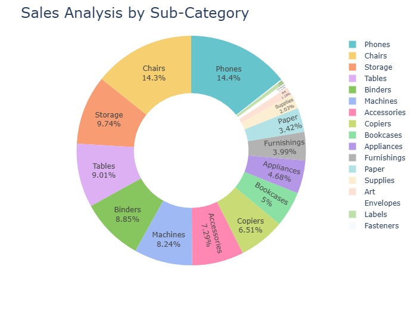
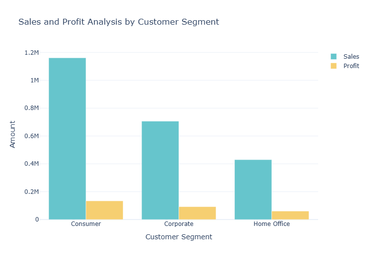
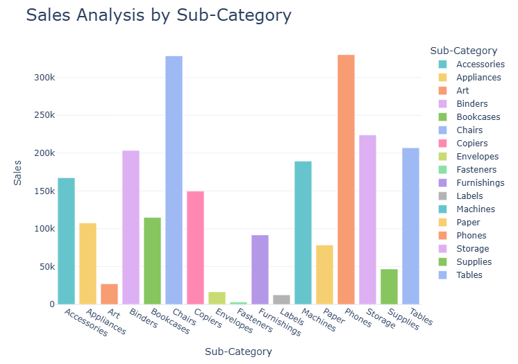

A Data-driven exploratory analysis of the Superstore dataset to indentify sales trends, profit patterns, regional performances and business insights using Python.

Objective: The objective of this project is to analyse retail sales data to uncover meaningful insights related to revenue generation, profitability, regional performance, and the impact of discounts on the profits.

Dataset:
 1. Source: Superstore Sales Dataset
 2. Records: 9995 
 3. Features: 21
 4. Contains information about orders, sales, profit, discounts, regions, category and customer segments.

Data Preprocessing:
 1. Chacked and handled missing values
 2. Removal of missing values
 3. Converted datatypes where required
 4. Performed Statistical summary

Exploratory Data Analysis:
The following analysis was performed:
 1. Sales and Profit Distribution
 2. Region wise sales and profitability
 3. Segment-wise revenue contribution
 4. Impact of discount on profit
 5. Correlation analysis between numerical features.

 Tools & Technologies Used

- Python
- Pandas
- NumPy
- Plotly
- Jupyter Notebook

   Visualizations

### Sales by Category

### Sales by Sub-Category

### Customer Segment Analysis

### Sales by Sub-Category (Bar Graph)

